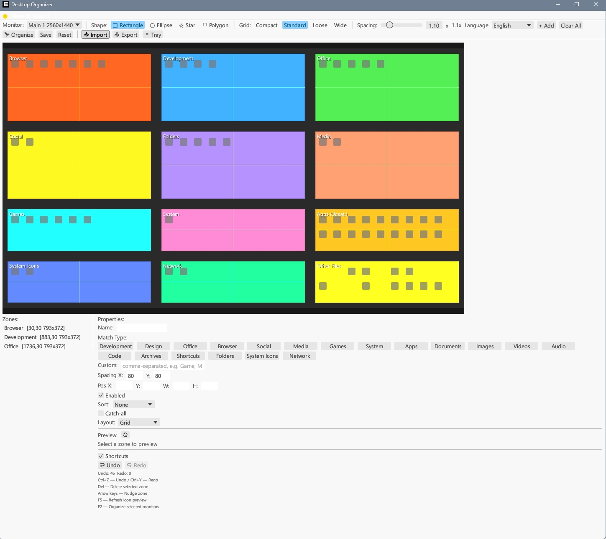

# DesktopOrganizer

Desktop icon auto-organizer — zero persistence, zero background process, event-driven.



## Features

- **Smart Classification** — 180+ keyword category matching, `.exe` sub-categorized by function
- **Multi-Monitor** — Independent layout per display (3×3 grid by default)
- **Shape Arrangement Engine** — 13 layout shapes with sub-zone nesting
- **Undo/Redo** — Up to 50 history levels, drag-resize zones
- **Multi-Language** — English, 中文, 한국어, 日本語, हिन्दी
- **System Tray** — Minimize to tray, event-driven auto-organize via `ReadDirectoryChangesW` (zero CPU idle)
- **Grid Snapping** — Multiple density presets (10/30/60/100px)

## Tech Stack

| Component | Technology |
|-----------|-----------|
| Language | Rust |
| UI Framework | eframe / egui 0.31 |
| Win32 API | windows-rs 0.58 |
| Desktop Control | Win32 Shell ListView API |
| File Watcher | `ReadDirectoryChangesW` (event-driven) |
| Single Instance | `CreateMutexW` |

## Build

```bash
cargo build --release           # Compile
tools\inject_icon.bat            # Inject icon (requires rcedit)
```

Output: `target/release/desktop-organizer.exe`

## Usage

1. Run `DesktopOrganizer.exe`
2. Right-click tray icon → select language
3. On close: choose "Minimize to tray" or "Exit"
4. Desktop file changes trigger automatic reorganization

## License

[MIT](LICENSE)
